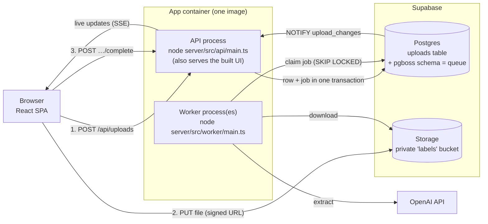

# Label extractor

Upload photos or PDFs of product labels; a background worker reads each one with an LLM and extracts the **product name, brand, ingredients, allergens and net weight** as validated, structured JSON.


- **Stack:** TypeScript end to end. React + Vite with Tailwind v4 and shadcn/ui (web), Fastify (API), pg-boss (Postgres-backed queue), Supabase (Postgres + Storage), OpenAI Responses API with structured outputs.
- **Look and feel:** built on the same UI stack as the SupplyScope app (Tailwind v4, shadcn/ui on Radix, Lucide icons, Sonner toasts) and styled with SupplyScope's brand. See [DECISIONS.md](DECISIONS.md#frontend).
- **Design decisions** (queue choice, failure handling, 50k uploads, trade-offs): [DECISIONS.md](DECISIONS.md)

## Topology



**Live:** https://api-production-4ec2.up.railway.app

| Piece | What runs it | In production |
|---|---|---|
| **Web app** | Static files built by Vite. Served by the API process in production, or by the Vite dev server in development. | Railway `api` service |
| **API** | Node process (`server/src/api/main.ts`). Stateless; scale by adding instances. Never calls the LLM. | Railway `api` service (Singapore), public domain above, `APP_PROCESS=api` |
| **Worker** | A separate Node process (`server/src/worker/main.ts`), same image with `APP_PROCESS=worker`. Scale by adding replicas; each handles `WORKER_CONCURRENCY` jobs at once. | Railway `worker` service (Singapore), no public port |
| **Queue** | [pg-boss](https://github.com/timgit/pg-boss) tables in the `pgboss` schema of the same Postgres database. | Supabase Postgres (ap-southeast-1) |
| **Database** | Postgres, with the `uploads` table as the source of truth for status and results. | Supabase Postgres (ap-southeast-1), via the session pooler |
| **File storage** | A private bucket. Browsers upload with short-lived signed URLs; size and type limits are enforced by the bucket. | Supabase Storage (ap-southeast-1) |

**Deploying changes:** `railway up --service api` and `railway up --service worker` build the Dockerfile and roll out each service. Schema changes go through `supabase db push`. Variables are listed in `server/.env.example`. `DATABASE_URL` is the **session pooler** URL, because the direct connection is IPv6-only on Supabase's free tier, and `DATABASE_POOL_MAX=2` keeps both services inside the free tier's connection limit.

### Upload lifecycle

```
uploading ─(browser confirms)─► queued ─(worker claims)─► processing ─► completed
  (hidden)                        ▲                            │
                                  └──(transient error; retry)──┤
                                                               └──► failed (reason shown; retry if it could help)
```

- **Every upload finishes.** Creating an upload schedules a *finalise* job for just after its signed URL expires. It confirms a file the browser never confirmed, or discards an upload whose file never arrived. When the browser does confirm, the job is cancelled in the same transaction.
- **Rejected files aren't kept.** Content that isn't really a JPEG, PNG, WebP or PDF is deleted with its upload; the browser shows why, with "Try again".
- **Duplicates are recognised.** An identical file (same SHA-256) points to the existing upload instead of being processed again.

### Monitoring

- **System status page** (`/status` in the app, from `GET /api/ops`): health checks, worker heartbeat, queue, last 24 hours, failures by reason, and the alert log.
- **`GET /api/health`** on the API (database, queue) and on the worker (plus its job loop) answers 200 or 503. Railway uses it on deploy.
- **Alerts** open and resolve once a minute (see `server/src/ops/monitor.ts`) and are logged once each, with an `alert` field.

## Running locally

**Prerequisites:** Node 22.18 or newer (the server runs TypeScript directly), Docker, and the [Supabase CLI](https://supabase.com/docs/guides/local-development/cli/getting-started).

```bash
npm install
supabase start                     # local Postgres + Storage in Docker; applies supabase/migrations
cp server/.env.example server/.env # then fill in the two blanks:
                                   #   SUPABASE_SECRET_KEY  ← SECRET_KEY from `supabase status -o env`
                                   #   OPENAI_API_KEY       ← your key
npm run dev                        # API :3000, worker, and web on http://localhost:5173
```

`samples/` has a label as PNG and PDF, and a text file renamed to `.jpg` to try the content check.

**Production image via Docker Compose** (API serving the built UI on http://localhost:3000, plus two workers):

```bash
supabase start
docker compose up --build
```

## Tests

```bash
npm test                  # all unit tests (shared, server, web). No network, no LLM, no Docker needed.
npm run test:integration -w server   # real pg-boss worker against local Postgres (needs `supabase start`)
```

The LLM is never called from tests. The worker depends on a `LabelExtractor` interface, and the OpenAI extractor takes an injected "create response" function that tests replace with canned responses.

| Required case | Where |
|---|---|
| **Unsupported file type** | `shared/test/files.test.ts` (extensions, MIME types, HEIC, size, empty); `server/test/api/uploads.test.ts` (422 from the API; a text file renamed `.jpg` is caught by byte sniffing) |
| **Malformed / invalid LLM response** | `server/test/extraction/openai-extractor.test.ts` (not JSON, truncated, wrong types, bad units, empty, refusal, content filter); `server/test/worker/process-upload.test.ts` (malformed output is retried, never stored) |
| **Job failure and retry** | `server/test/worker/process-upload.test.ts` (transient error → retry, recovery on a later attempt, give up after the last attempt, permanent errors not retried, duplicate/stale jobs); `server/test/integration/worker.integration.test.ts` (the same against real pg-boss, including a hung worker rescued by the dead-letter queue) |

## Project structure

```
shared/          Types, Zod schemas and rules used by all three: file rules, extraction schema, HTTP contract
server/
  src/api/       HTTP API process (Fastify): routes that turn use-case outcomes into responses, errors
  src/worker/    Worker process: the extraction job (retry decisions) and a handler per queue
  src/extraction/ LLM integration: interface, errors, OpenAI implementation and its error mapping,
                 prompt, shared rate limiter
  src/uploads/   The uploads domain: the table's guarded transitions, the use cases (intake, finalise,
                 retry), its queues, the live change feed, exports and response mapping
  src/ops/       Health checks, the alert monitor, its data and the status page's response
  src/infra/     Config, database, queue connection, storage, logging, file-type sniffing
  scripts/       One-off data changes, committed so they're reviewable and re-runnable
  test/          Unit tests (with in-memory fakes) and the integration test
web/src/
  api/           API client and React Query hooks (polling lives here)
  features/      upload (dropzone + upload manager), uploads-list (list + status tabs), upload-detail (side panel)
  components/    App sidebar and small shared pieces (status pill, file-type tile, errors)
  components/ui/ shadcn/ui components, generated by the shadcn CLI and lightly adapted
  index.css      Tailwind theme: SupplyScope's brand tokens mapped onto shadcn's variables
supabase/        Local config and the SQL migrations
```

## API

| Method | Path | |
|---|---|---|
| `POST` | `/api/uploads` | Validate `{ fileName, mimeType, sizeBytes, sha256? }`; return `{ kind: 'created', upload, uploadUrl }`, or `{ kind: 'duplicate', upload }` for a file already processed |
| `POST` | `/api/uploads/:id/complete` | Check the uploaded bytes and queue the upload (idempotent); 422 and nothing kept if the content isn't a supported type |
| `GET` | `/api/uploads?status=&cursor=&limit=` | One page of a view (`all`, `in-progress`, `completed`, `failed`), newest first, with `nextCursor` |
| `GET` | `/api/uploads/counts` | How many uploads each view holds |
| `GET` | `/api/uploads/:id` | One upload with its extracted data and a preview URL |
| `POST` | `/api/uploads/:id/retry` | Run extraction again, for failures that could succeed and results that can't be read |
| `GET` | `/api/events` | Server-sent events announcing upload changes |
| `GET` | `/api/health` | Health checks: 200 or 503 |
| `GET` | `/api/ops` | Everything on the System status page |
| `GET` | `/api/exports/uploads.csv` | Every completed extraction as CSV, one row per product (streamed) |
| `GET` | `/api/exports/uploads.json` | The same, as JSON with the full structured data |

Errors are always `{ "error": { "code", "message" } }`, with a message written for users.

## Scope cuts

Deliberately left out to stay within the time box. The reasoning is in [DECISIONS.md](DECISIONS.md#other-trade-offs-and-things-deliberately-left-out).

- **Authentication and per-user data:** everyone sees one shared list.
- **HEIC conversion** and a **PDF page-count limit**.
- **CI/CD.** Deploys are run by hand with `railway up`. Next steps would be tests on every push and Railway deploying from GitHub.
