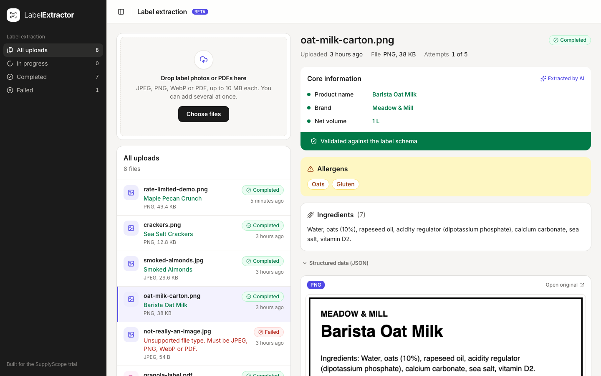
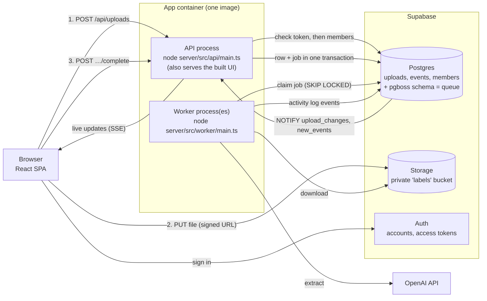

# Label extractor

Upload photos or PDFs of product labels; a background worker reads each one with an LLM and extracts the **product name, brand, ingredients, allergens and net weight** as validated, structured JSON.



- **Stack:** TypeScript end to end. React + Vite with Tailwind v4 and shadcn/ui (web), Fastify (API), pg-boss (Postgres-backed queue), Supabase (Postgres, Storage, Auth), OpenAI Responses API with structured outputs.
- **Look and feel:** built on the same UI stack as the SupplyScope app (Tailwind v4, shadcn/ui on Radix, Lucide icons, Sonner toasts) and styled with SupplyScope's brand. See [DECISIONS.md](DECISIONS.md#trade-offs).
- **Design decisions** (queue choice, failure handling, 50k uploads, trade-offs): [DECISIONS.md](DECISIONS.md)

## Topology



**Live:** https://api-production-4ec2.up.railway.app

| Piece | What runs it | In production |
|---|---|---|
| **Web app** | Static files built by Vite. Served by the API process in production, or by the Vite dev server in development. | Railway `api` service |
| **API** | Node process (`server/src/api/main.ts`). Stateless; scale by adding instances. Never calls the LLM. | Railway `api` service (Singapore), public domain above, `APP_PROCESS=api` |
| **Worker** | A separate Node process (`server/src/worker/main.ts`), same image with `APP_PROCESS=worker`. Scale by adding replicas; each handles `WORKER_CONCURRENCY` jobs at once. | Railway `worker` service (Singapore), no public port |
| **Queue** | [pg-boss](https://github.com/timgit/pg-boss) tables in the `pgboss` schema of the same Postgres database. | Supabase Postgres (ap-southeast-1) |
| **Database** | Postgres, with the `uploads` table as the source of truth for status and results, the `events` table as the activity log, and `members` for who has access and as what (admin or member). | Supabase Postgres (ap-southeast-1), via the session pooler |
| **Sign-in** | Supabase Auth: email and password, accounts created by a script (no public sign-up). The API checks each request's access token, then the `members` table. | Supabase Auth |
| **File storage** | A private bucket. Browsers upload with short-lived signed URLs; size and type limits are enforced by the bucket. | Supabase Storage (ap-southeast-1) |

**Deploying changes:** `railway up --service api` and `railway up --service worker` build the Dockerfile and roll out each service. Schema changes go through `supabase db push`. Variables are listed in `server/.env.example`. `DATABASE_URL` is the **session pooler** URL, because the direct connection is IPv6-only on Supabase's free tier, and `DATABASE_POOL_MAX=2` keeps both services inside the free tier's connection limit.

### Upload lifecycle

```
uploading ─(browser confirms)─► queued ─(worker claims)─► processing ─► completed ─(people review)─┐
  (hidden)                        ▲                            │            ▲                     │
  │ rejected or                   └──(transient error; retry)──┤            └─────────────────────┘
  ▼ never arrived                                              └──► failed (reason shown)
(deleted)          Also: failed, or completed with an unreadable result ─(run again)─► queued;
                   queued|processing ─(every attempt died: dead-letter safety net)─► failed
```

Each of these moves is declared once, in `shared/src/lifecycle.ts`; the database only makes a move
from a status that table allows.

- **Every upload finishes.** Creating an upload schedules a *finalise* job for just after its signed URL expires. It confirms a file the browser never confirmed, or discards an upload whose file never arrived. When the browser does confirm, the job is cancelled in the same transaction.
- **Rejected files aren't kept.** Content that isn't really a JPEG, PNG, WebP or PDF is deleted with its upload; the browser shows why, with "Try again".
- **Duplicates are recognised.** An identical file (same SHA-256) points to the existing upload instead of being processed again.

### Confidence scores

Every field gets a score out of 100 for how sure the extraction is, with the reasons for any doubt. The model scores each field in the same call, and those scores are stored as given. Plain checks cap a score at 60 when the data contradicts itself (the net amount missing from its printed text, a declared allergen no ingredient contains, percentages over 100%); they run whenever the upload is read, so they describe the data as it is now, edits included. The detail panel shows each field's score, fine (85+), check (60–84) or low; the list flags uploads whose least certain field is below 85. How it works and its limits: [DECISIONS.md](DECISIONS.md#trade-offs).

### Reviewing and editing

Any field can be corrected in place in the detail panel: the product name, brand, net weight (amount and unit), allergens, and ingredients (name and percentage, add or remove rows). A field that scored under 85 can also be marked as checked. A reviewed field shows who reviewed it instead of its score, and stops counting towards the upload's confidence. Edits are validated like model output, the model's original output is kept, and two people saving at once can't overwrite each other: the second is told, keeps their draft, and chooses whether it still applies. Exports use the edited data.

### Deleting

Whoever uploaded a file, or any admin, can delete it from the detail panel, after confirming. The file and its extracted data go for good; the activity log keeps what happened to it, and who deleted it. Uploads from before sign-in have no uploader, so only admins can delete those. It works mid-extraction too: that attempt stands down once the upload is gone.

### Monitoring

Both pages are for admins only.

- **System status page** (`/status` in the app, from `GET /api/ops`): uploads waiting, retrying and processing; whether the worker is running; health checks; the last 24 hours; and failures by reason.
- **Activity log** (`/logs` in the app, from `GET /api/logs`): every step of every upload (created, queued, each extraction attempt, retries, failures and why), plus rate-limit pauses and process starts. Narrow it to any mix of event types (with shortcuts for warnings and errors), or to one upload with `?upload=<id>` in the address, and it updates live. Kept for 30 days.
- **`GET /api/health`** on the API (database, queue) and on the worker (plus its job loop) answers 200 or 503, naming which check failed but not the error's details (the status page shows those). Railway uses it on deploy.

## Running locally

**Prerequisites:** Node 22.18 or newer (the server runs TypeScript directly), Docker, and the [Supabase CLI](https://supabase.com/docs/guides/local-development/cli/getting-started).

```bash
npm install
supabase start                     # local Postgres + Storage in Docker; applies supabase/migrations
cp server/.env.example server/.env # then fill in the three blanks:
                                   #   SUPABASE_SECRET_KEY      ← SECRET_KEY from `supabase status -o env`
                                   #   SUPABASE_PUBLISHABLE_KEY ← PUBLISHABLE_KEY, same place
                                   #   OPENAI_API_KEY           ← your key
supabase migration up              # only if the database was already running: applies new migrations
npm run create-user -w server -- --email you@example.com --role admin
npm run dev                        # API :3000, worker, and web on http://localhost:5173
```

Sign in with the account you created. There's no public sign-up: accounts come from the script,
which also changes someone's role (`--role member`) or password. `samples/` has a label as PNG and
PDF, and a text file renamed to `.jpg` to try the content check.

**Production image via Docker Compose** (API serving the built UI on http://localhost:3000, plus two workers):

```bash
supabase start
docker compose up --build
```

## Tests

```bash
npm test                  # all unit tests (shared, server, web). No network, no LLM, no Docker needed.
npm run test:integration -w server   # real pg-boss worker against local Postgres (needs `supabase start`)
```

The LLM is never called from tests. The worker depends on a `LabelExtractor` interface, and the OpenAI extractor takes an injected "create response" function that tests replace with canned responses.

| Required case | Where |
|---|---|
| **Unsupported file type** | `shared/test/files.test.ts` (extensions, MIME types, HEIC, size, empty); `server/test/api/uploads.test.ts` (422 from the API; a text file renamed `.jpg` is caught by byte sniffing) |
| **Malformed / invalid LLM response** | `server/test/extraction/openai-extractor.test.ts` (not JSON, truncated, wrong types, bad units, empty, refusal, content filter); `server/test/worker/process-upload.test.ts` (malformed output is retried, never stored) |
| **Job failure and retry** | `server/test/worker/process-upload.test.ts` (transient error → retry, recovery on a later attempt, give up after the last attempt, permanent errors not retried, duplicate/stale jobs); `server/test/integration/worker.integration.test.ts` (the same against real pg-boss, including a hung worker rescued by the dead-letter queue) |

## Project structure

```
shared/          Types and rules used by all three: file rules, upload lifecycle, label fields, confidence
                 bands and checks, units, roles, the event catalogue, the HTTP contract. Its Zod schemas
                 (extraction.ts, requests.ts) are only loaded by the server; the web build fails if
                 Zod gets bundled
server/
  src/api/       HTTP API process (Fastify): routes that turn use-case outcomes into responses, errors,
                 the sign-in check and the admin-only guard
  src/auth/      Who a request is from: access-token check and the members table (roles)
  src/worker/    Worker process: the extraction job, a handler per queue, and once-a-minute
                 housekeeping (the worker heartbeat and pruning the activity log)
  src/extraction/ LLM integration: interface, errors, retry policy, OpenAI implementation and its
                 error mapping, prompt, shared rate limiter
  src/uploads/   The uploads domain: the table's guarded transitions, the use cases (intake, finalise,
                 edit, retry, detail), its queues, exports and response mapping
  src/logs/      The activity log: the events table, the catalogue of events (wording in one place)
  src/ops/       Health checks, the worker heartbeat and the status page's data
  src/infra/     Config, database, queue connection, storage, stdout logging, file-type sniffing, and the
                 live change feed (Postgres NOTIFY → server-sent events)
  scripts/       create-user.ts (accounts and roles), and one-off data changes, committed so they're
                 reviewable and re-runnable
  test/          Unit tests (with in-memory fakes) and the integration test
web/src/
  app/           Router, app shell (sidebar and top bar), 404 page
  auth/          Supabase Auth in the browser, the sign-in page, and the route guards
  api/           API client, React Query hooks and cache refreshing, live updates (polling as fallback)
  features/      upload (dropzone + upload manager), uploads-list (list + status tabs),
                 upload-detail (side panel), system-status, logs (the activity log)
  components/    Small shared pieces (status pill, file-type tile, row layout, segmented tabs, errors)
  components/ui/ shadcn/ui components, generated by the shadcn CLI and lightly adapted
  lib/           Plain helpers: formatting, what an upload's state means, status colours, quantities
  routes.ts      Every path in the app
  index.css      Tailwind theme: SupplyScope's brand tokens mapped onto shadcn's variables
supabase/        Local config and the SQL migrations
```

## API

Every route needs `Authorization: Bearer <access token>` from Supabase Auth, except `/api/health` and
`/api/config`. Without it: 401. Signed in but not a member: 403. If Supabase Auth can't be reached to
check the token: 503 `AUTH_UNAVAILABLE`, so an Auth outage doesn't sign everyone out.

| Method | Path | |
|---|---|---|
| `GET` | `/api/config` | Public: the Supabase URL and publishable key the browser signs in with |
| `GET` | `/api/me` | The signed-in member: `{ id, email, role }` |
| `POST` | `/api/uploads` | Validate `{ fileName, mimeType, sizeBytes, sha256? }`; return `{ kind: 'created', upload, uploadUrl }`, or `{ kind: 'duplicate', upload }` for a file already processed |
| `POST` | `/api/uploads/:id/complete` | Check the uploaded bytes and queue the upload (idempotent); 422 and nothing kept if the content isn't a supported type |
| `GET` | `/api/uploads?status=&cursor=&limit=` | One page of a view (`all`, `in-progress`, `completed`, `failed`), newest first, with `nextCursor` |
| `GET` | `/api/uploads/counts` | How many uploads each view holds |
| `GET` | `/api/uploads/:id` | One upload with its extracted data and a preview URL |
| `POST` | `/api/uploads/:id/retry` | Run extraction again, for failures that could succeed and results that can't be read |
| `PATCH` | `/api/uploads/:id/result` | Correct fields (`changes`) or confirm them (`checked`), made against `revision`. 422 for an invalid value, 409 if someone saved since |
| `DELETE` | `/api/uploads/:id` | Delete the upload and its file: 204. Only its uploader or an admin (403 otherwise); the detail says which as `canDelete` |
| `GET` | `/api/events` | Server-sent events announcing upload changes and new activity-log events. Ends when the access token runs out (or after 15 minutes), and the browser reconnects with its current token |
| `GET` | `/api/logs?type=&type=&upload=&cursor=&limit=` | Admins only. One page of the activity log, newest first, with `nextCursor`. One `type` per type of event wanted; none means every type |
| `GET` | `/api/health` | Public. Health checks: 200 or 503 |
| `GET` | `/api/ops` | Admins only. Everything on the System status page |
| `GET` | `/api/exports/uploads.csv` | Every completed extraction as CSV, one row per product (streamed) |
| `GET` | `/api/exports/uploads.json` | The same, as JSON with the full structured data |

Errors are always `{ "error": { "code", "message" } }`, with a message written for users.

## Scope cuts

Deliberately left out to stay within the time box. The reasoning is in [DECISIONS.md](DECISIONS.md#trade-offs).

- **Team management and per-user data:** one shared workspace. Accounts come from a script; there are no invites, sign-up or password-reset emails.
- **HEIC conversion** and a **PDF page-count limit**.
- **CI/CD.** Deploys are run by hand with `railway up`. Next steps would be tests on every push and Railway deploying from GitHub.
