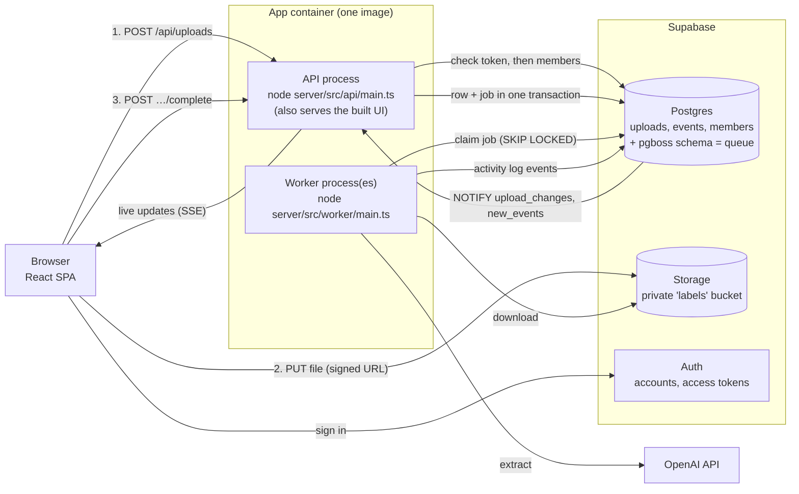

# Label extractor

Upload photos or PDFs of product labels; a background worker reads each one with an LLM and extracts the **product name, brand, ingredients, allergens and net weight** as validated, structured JSON.


- **Stack:** TypeScript end to end. React + Vite with Tailwind v4 and shadcn/ui (web), Fastify (API), pg-boss (Postgres-backed queue), Supabase (Postgres, Storage, Auth), OpenAI Responses API with structured outputs.
- **Look and feel:** built on the same UI stack as the SupplyScope app (Tailwind v4, shadcn/ui on Radix, Lucide icons, Sonner toasts) and styled with SupplyScope's brand. See [DECISIONS.md](DECISIONS.md#trade-offs).
- **Design decisions** (queue choice, failure handling, 50k uploads, performance, trade-offs): [DECISIONS.md](DECISIONS.md)

## Topology



**Live:** https://api-production-4ec2.up.railway.app

| Piece | What runs it | In production |
|---|---|---|
| **Web app** | Static files built by Vite. Served by the API process in production, or by the Vite dev server in development. | Railway `api` service |
| **API** | Node process (`server/src/api/main.ts`). Stateless; scale by adding instances. Never calls the LLM. | Railway `api` service (Singapore), public domain above, `APP_PROCESS=api` |
| **Worker** | A separate Node process (`server/src/worker/main.ts`), same image with `APP_PROCESS=worker`. Scale by adding replicas; each handles `WORKER_CONCURRENCY` jobs at once. | Railway `worker` service (Singapore), no public port |
| **Queue** | [pg-boss](https://github.com/timgit/pg-boss) tables in the `pgboss` schema of the same Postgres database. | Supabase Postgres (ap-southeast-1) |
| **Database** | Postgres, with the `uploads` table as the source of truth for status and results, the `events` table as the activity log, and `members` for who has access and as what (admin or member). | Supabase Postgres (ap-southeast-1), via the session pooler |
| **Sign-in** | Supabase Auth: email and password, accounts created by a script (no public sign-up). The API checks each request's access token, then the `members` table. | Supabase Auth |
| **File storage** | A private bucket. Browsers upload with short-lived signed URLs; size and type limits are enforced by the bucket. | Supabase Storage (ap-southeast-1) |

**Deploying changes:** `railway up --service api` and `railway up --service worker` build the Dockerfile and roll out each service. Schema changes go through `supabase db push`. Variables are listed in `server/.env.example`. `DATABASE_URL` is the **session pooler** URL, because the direct connection is IPv6-only on Supabase's free tier, and `DATABASE_POOL_MAX=2` keeps both services inside the free tier's connection limit.

### Upload lifecycle

```
uploading ─(browser confirms)─► queued ─(worker claims)─► processing ─► completed ─(review, revert, submit)─┐
  (hidden)                        ▲                            │            ▲                              │
  │ rejected or                   └──(transient error; retry)──┤            └──────────────────────────────┘
  ▼ never arrived                                              └──► failed (reason shown)
(deleted)          Also: failed, or completed with an unreadable result ─(run again)─► queued;
                   queued|processing ─(every attempt died: dead-letter safety net)─► failed;
                   queued|processing|completed|failed ─(its uploader or an admin deletes it)─► (deleted)
```

Each of these moves is declared once, in `shared/src/lifecycle.ts`; the database only makes a move
from a status that table allows.

- **Three stages: Upload, Review, Products.** A file dropped under *Upload* is sent and read under the *Uploading* tab, then waits under the *Review* tab until its uploader submits it to *Products*, which everyone shares. Until it's submitted it's the uploader's alone: nobody else can list it, open it, edit it, read its history, act on it or be sent its live changes (every route that names it answers 404, admins included). Each person can pick up to 50 files at a time and have up to 200 under way.
- **Finding and acting on products.** Products can be searched (product name, brand or file name) and filtered by the days they were added (a common span, or any range on a calendar), by the server. Tick products (a row's box shows on hover) to export or delete them together; with none ticked, Export takes every product the search and filter match. Review can be ticked too ("Select all" ticks every one), so "Mark as checked" and "Submit" act on just those.
- **Nothing unsure goes into Products unchecked.** A product can only be submitted once every field the model scored under 85 has been checked or corrected by a person. The server enforces it, not just the buttons. Review offers "Mark all as checked" (after a confirmation) and "Submit all ready"; the detail panel offers the same for one product. Reading a product again takes it back out of Products, to be reviewed again, so only its uploader or an admin can ask for that.
- **Every upload finishes.** Creating an upload schedules a *finalise* job for just after its signed URL expires. It confirms a file the browser never confirmed, or discards an upload whose file never arrived. When the browser does confirm, the job is cancelled in the same transaction.
- **Rejected files aren't kept.** Content that isn't really a JPEG, PNG, WebP or PDF is deleted with its upload; the browser shows why, with "Try again".
- **Duplicates are recognised.** An identical file (same SHA-256) that's already in Products, or among the person's own uploads being read or reviewed, is pointed to instead of being processed again. Someone else's upload that isn't in Products doesn't count: it's theirs alone.

### Confidence scores

Every field gets a score out of 100 for how sure the extraction is, with the reasons for any doubt. The model scores each field in the same call, and those scores are stored as given. Plain checks cap a score at 60 when a product name, brand, net weight or ingredient list wasn't found (every product needs them, so a person must fill it in or confirm it's absent), or when the data contradicts itself (the net amount missing from its printed text, a declared allergen no ingredient contains, percentages over 100%); they run whenever the upload is read, so they describe the data as it is now, edits included. The detail panel shows each field's score, fine (85+), check (60–84) or low, and the card's footer gives the upload's overall confidence (its least certain unchecked field): green when high, amber or red when a field is worth checking. A completed upload below 85 shows "Check (72%)" in place of "Completed", in the list and the detail. A reading in Review with no scores (saved in a shape that can't be read, say) has every field at 60, "Not scored: check it against the label.", so each is checked before it can be submitted; a product that was never scored (from before scoring) shows no score. How it works and its limits: [DECISIONS.md](DECISIONS.md#trade-offs).

### Reviewing and editing

Any field can be corrected in place in the detail panel: the product name, brand, net weight (amount and unit), allergens, and ingredients (name and percentage, add or remove rows). The fields that scored under 85 can also be confirmed as right all at once, with "Mark as checked" in the card's footer. A checked or corrected field says "Checked" or "Edited" in place of its score, and counts as 100% in the upload's confidence; the detail's header says who last edited or checked the data, and when. Edits are validated like model output, the model's original output is kept, and two people saving at once can't overwrite each other: the second is told, keeps their draft, and chooses whether it still applies. Exports use the edited data. Every state the data has been in is saved as a version (the original reading, each edit or check, each revert), so an admin can put a product back to any of them from its history with "Revert"; the revert is recorded too, so nothing is lost. The history (collapsed on each product until opened) reads newest first, a page at a time, and can be searched and filtered by type of event and by day; each change's "Details" show what it did (the fields before and after, as a diff) or, for a reading, the data as JSON, fetched only when opened.

### Deleting

Whoever uploaded a product, or any admin, can delete it from the detail panel (or several at once from Products), after confirming; its file goes with it. Both go for good, but the activity log keeps what happened to it, who deleted it, and the product's data (name, brand, ingredients and so on) in the event's details; that event is written in the same transaction as the delete, so neither happens without the other. Uploads from before sign-in have no uploader, so only admins can delete those. It works mid-extraction too: that attempt stands down once the upload is gone.

### Monitoring

- **System page** ("Status & activity" in the sidebar, `/system`, admins only), with two parts:
  - **Status strip** (from `GET /api/ops`): uploads waiting, retrying and processing; the last 24 hours; and the system's checks (database, queue, and whether a worker has checked in within the last 3 minutes), as "All OK" with each one's detail on hover, or which failed and why ("Database and workers down").
  - **Activity log** (from `GET /api/logs`), underneath: every step of every upload (created, queued, each extraction attempt, retries, failures and why), plus rate-limit pauses and process starts. Search its messages, narrow it to any mix of event types (with shortcuts for warnings and errors), or to a span of days, or to one upload with `?upload=<id>` in the address, and it updates live. It loads a page at a time, and each event's details only when opened. A product's events are kept for as long as it exists, and for 30 days after it's deleted; the system's own, for 30 days.
- **`GET /api/health`** on the API (database, queue) and on the worker (plus its job loop) answers 200 or 503, naming which check failed but not the error's details (the System page shows those). Railway uses it on deploy.

## Running locally

**Prerequisites:** Node 22.18 or newer (the server runs TypeScript directly), Docker, and the [Supabase CLI](https://supabase.com/docs/guides/local-development/cli/getting-started).

```bash
npm install
supabase start                     # local Postgres + Storage in Docker; applies supabase/migrations
cp server/.env.example server/.env # then fill in the three blanks:
                                   #   SUPABASE_SECRET_KEY      ← SECRET_KEY from `supabase status -o env`
                                   #   SUPABASE_PUBLISHABLE_KEY ← PUBLISHABLE_KEY, same place
                                   #   OPENAI_API_KEY           ← your key
supabase migration up              # only if the database was already running: applies new migrations
npm run create-user -w server -- --email you@example.com --role admin
npm run dev                        # API :3000, worker, and web on http://localhost:5173
```

Sign in with the account you created. There's no public sign-up: accounts come from the script,
which also changes someone's role (`--role member`) or password. `samples/` has a label as PNG and
PDF, and a text file renamed to `.jpg` to try the content check.

**Production image via Docker Compose** (API serving the built UI on http://localhost:3000, plus two workers):

```bash
supabase start
docker compose up --build
```

## Tests

```bash
npm test                  # all unit tests (shared, server, web). No network, no LLM, no Docker needed.
npm run test:integration -w server   # real pg-boss worker and members table against local Postgres (needs `supabase start`)
```

The LLM is never called from tests. The worker depends on a `LabelExtractor` interface, and the OpenAI extractor takes an injected "create response" function that tests replace with canned responses.

| Required case | Where |
|---|---|
| **Unsupported file type** | `shared/test/files.test.ts` (extensions, MIME types, HEIC, size, empty); `server/test/api/uploads.test.ts` (422 from the API; a text file renamed `.jpg` is caught by byte sniffing) |
| **Malformed / invalid LLM response** | `server/test/extraction/openai-extractor.test.ts` (not JSON, truncated, wrong types, bad units, empty, refusal, content filter); `server/test/worker/process-upload.test.ts` (malformed output is retried, never stored) |
| **Job failure and retry** | `server/test/worker/process-upload.test.ts` (transient error → retry, recovery on a later attempt, give up after the last attempt, permanent errors not retried, duplicate/stale jobs); `server/test/integration/worker.integration.test.ts` (the same against real pg-boss, including a hung worker rescued by the dead-letter queue) |

## Project structure

```
shared/          Types and rules used by all three: file rules, upload lifecycle, label fields, confidence
                 bands and checks, units, roles and who may do what, the event catalogue, search and
                 page limits, the HTTP contract. Its Zod schemas
                 (extraction.ts, requests.ts) are only loaded by the server; the web build fails if
                 Zod gets bundled
server/
  src/api/       HTTP API process (Fastify): routes that turn use-case outcomes into responses, paging
                 and route parameters, errors, the sign-in check and the admin-only guard
  src/auth/      Who a request is from: access-token check and the members table (roles)
  src/worker/    Worker process: the extraction job, a handler per queue, and once-a-minute
                 housekeeping (the worker heartbeat and pruning the activity log)
  src/extraction/ LLM integration: interface, errors, retry policy, OpenAI implementation and its
                 error mapping, prompt, shared rate limiter
  src/uploads/   The uploads domain: the table's guarded transitions, who may reach which upload
                 (access), the use cases (intake, finalise, detail, edit, check, submit, retry,
                 revert, delete, history), its queues, exports and response mapping
  src/logs/      The activity log: the events table, the catalogue of events (wording in one place)
  src/ops/       Health checks, the worker heartbeat and the System page's status
  src/infra/     Config, database, queue connection, storage, stdout logging, file-type sniffing, and the
                 live change feed (Postgres NOTIFY → server-sent events)
  scripts/       create-user.ts (accounts and roles), and one-off data changes, committed so they're
                 reviewable and re-runnable
  test/          Unit tests (with in-memory fakes) and the integration tests
web/src/
  app/           Router, app shell (sidebar and top bar), 404 page, the error page a failed route shows
  auth/          Supabase Auth in the browser, the sign-in page, and the route guards
  api/           API client, React Query hooks and cache refreshing, live updates (polling as fallback)
  features/      upload (dropzone + upload manager), uploads-list (Uploading and Review tabs, Products),
                 upload-detail (side panel), system (the System page), activity (what the activity
                 log and each product's history share: filters, event rows, details) with activity/log
                 (the System page's activity log)
  components/    Small shared pieces: status pill, file-type tile, row layout, segmented tabs, and the
                 states every page uses (EmptyState, StaleDataNotice, InlineError, LoadMoreButton,
                 PageSpinner, ErrorBoundary, ConfirmDialog)
  components/ui/ shadcn/ui components, generated by the shadcn CLI and lightly adapted
  lib/           Plain helpers: formatting, what an upload's state means, status colours, quantities,
                 day ranges, selection, and importWithReload (reloads onto a new build if a page's
                 code is gone after a deploy)
  test/          Test helpers: a fake API (stubbed fetch), rendering with the app's providers, fixtures
  routes.ts      Every path in the app
  index.css      Tailwind theme: SupplyScope's brand tokens mapped onto shadcn's variables
supabase/        Local config and the SQL migrations
```

**Loading, empty and error states** work the same way on every list. A first load shows skeleton rows, and a new search keeps the last results up, faded, until its own arrive. An empty list says so and offers the way out ("No products match", with "Clear filters"); an empty Uploading or Review tab isn't shown. A first load that fails says why, with "Try again"; a failed refresh keeps what's shown and says it may be out of date; a failed "Load more" says so beside the button. A page that fails to render shows "Reload" and a way home, with the sidebar still there, and the detail panel fails on its own. Confirmations stay open, and say why, if the request fails.

**Sizing.** Nothing grows wider than its container, however long a file or product name: every stack is a single column that can shrink (`grid-cols-1`), text in a flex row has `min-w-0` and truncates or wraps, and a word too long for its line breaks (`index.css`). Where a window is too narrow for the list and the detail panel side by side (`--container-side-by-side`), the panel covers the list, and the list behind it is hidden from the keyboard and screen readers until it closes. Your uploads' tabs and Products scroll past six and a half rows (`ScrollingList`).

## API

Every route needs `Authorization: Bearer <access token>` from Supabase Auth, except `/api/health` and
`/api/config`. Without it: 401. Signed in but not a member: 403. If Supabase Auth can't be reached to
check the token: 503 `AUTH_UNAVAILABLE`, so an Auth outage doesn't sign everyone out. Every route
that names an upload (`/api/uploads/:id…`) answers 404 to someone who can't see it, before anything
else, so nobody learns of someone else's unsubmitted upload by being refused it.

| Method | Path | |
|---|---|---|
| `GET` | `/api/config` | Public: the Supabase URL and publishable key the browser signs in with |
| `GET` | `/api/me` | The signed-in member: `{ id, email, role }` |
| `POST` | `/api/uploads` | Validate `{ fileName, mimeType, sizeBytes, sha256? }`; return `{ kind: 'created', upload, uploadUrl }`, or `{ kind: 'duplicate', upload }` for an identical file already in Products or among the asker's own |
| `POST` | `/api/uploads/:id/complete` | Check the uploaded bytes and queue the upload (idempotent); 422 and nothing kept if the content isn't a supported type |
| `GET` | `/api/uploads?view=&q=&from=&to=&cursor=&limit=` | One page of a list, newest first, with `nextCursor`: `products` (everyone's submitted products, the default), `upload` (the asker's own uploads being read, or failed) or `review` (the asker's own read uploads waiting to be submitted). `q` searches product name, brand and file name; `from` and `to` (ISO date-times, `to` exclusive, `products` only) keep products added between them |
| `POST` | `/api/uploads/delete` | Delete `{ ids }` (up to 100): answers `{ deleted }`, skipping any the asker may not delete or can't see. All the files go in one storage request before any row; if storage can't be reached, nothing is deleted (503) |
| `POST` | `/api/uploads/submit` | Submit `{ ids }` (up to 100) to Products: answers `{ submitted }`, those that went in. Only the asker's own, with nothing left to check |
| `POST` | `/api/uploads/check` | Mark every flagged field of `{ ids }` (up to 100) as checked: answers `{ checked }`. Each is recorded like any other check |
| `GET` | `/api/uploads/:id` | One upload with its extracted data and a preview URL |
| `POST` | `/api/uploads/:id/retry` | Run extraction again, for any failure but a missing file, and for results that can't be read. Only its uploader or an admin (403 otherwise); the detail says whether the asker may as `canRetry` |
| `GET` | `/api/uploads/:id/history?q=&type=&from=&to=&cursor=&limit=` | One page of what happened to one upload, newest first, with `nextCursor`: its upload, each attempt to read it, and who edited, checked or reverted it. Searched and filtered like the activity log. Anyone who can see the upload |
| `GET` | `/api/uploads/:id/history/:eventId` | One entry's details, fetched when it's opened: the data as it was read, or what an edit or revert changed (404 for an entry the history offers no details for). Anyone who can see the upload |
| `POST` | `/api/uploads/:id/revert` | Admins only (403 otherwise). Puts a completed upload's data back to a version from its history (`{ revision, versionId }`); the revert is itself recorded and can be undone. A product stays in Products, even if the version has fields nobody had checked |
| `PATCH` | `/api/uploads/:id/result` | Correct fields (`changes`) or confirm them (`checked`), made against `revision`. 422 for an invalid value, 409 if someone saved since |
| `DELETE` | `/api/uploads/:id` | Delete the upload and its file: 204. Only its uploader or an admin (403 otherwise); the detail says which as `canDelete` |
| `GET` | `/api/events` | Server-sent events announcing upload changes (only those the person may see) and new activity-log events. Ends when the access token runs out (or after 15 minutes), and the browser reconnects with its current token |
| `GET` | `/api/logs?q=&type=&type=&from=&to=&upload=&cursor=&limit=` | Admins only. One page of the activity log, newest first, with `nextCursor`, each event without its details. `q` searches messages; one `type` per type of event wanted (none means every type); `from` and `to` are ISO date-times (`to` exclusive) |
| `GET` | `/api/logs/:id/details` | Admins only. One event's details, fetched when it's opened: the data as read, what a change did, or the codes and numbers its message leaves out |
| `GET` | `/api/health` | Public. Health checks: 200 or 503 |
| `GET` | `/api/ops` | Admins only. Everything in the System page's status strip |
| `GET` | `/api/exports/uploads.csv` | Products as CSV, one row per product (streamed): those named with `id=` (repeated, up to 100), or else every one matching `q`, `from` and `to` |
| `GET` | `/api/exports/uploads.json` | The same, as JSON with the full structured data |

Lists take `limit` (uploads 50 by default, up to 100; the log 50, up to 200; a history 20, up to 200) and `q` up to 200 characters, set in `shared/src/lists.ts`. Errors are always `{ "error": { "code", "message" } }`, with a message written for users.

## Scope cuts

Deliberately left out to stay within the time box. The reasoning is in [DECISIONS.md](DECISIONS.md#trade-offs).

- **Team management:** one shared workspace. Accounts come from a script; there are no invites, sign-up or password-reset emails.
- **HEIC conversion** and a **PDF page-count limit**.
- **CI/CD.** Deploys are run by hand with `railway up`. Next steps would be tests on every push and Railway deploying from GitHub.
